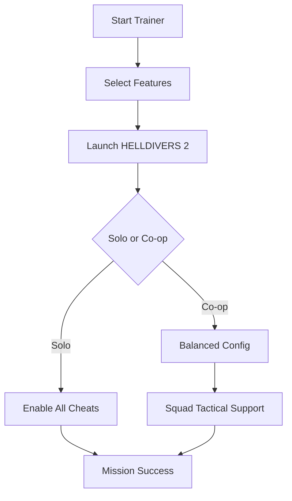

# HELLDIVERS 2 Trainer Tool 🛡️

Take command of your galactic missions with the **HELLDIVERS 2 Trainer**, a powerful enhancement tool designed to optimize survival, resource management, and squad coordination. Whether you’re going solo or deploying with friends, this trainer gives you flexible options to adapt every mission to your style.

---

## 🔎 Overview

HELLDIVERS 2 thrives on fast-paced co-op action where enemies swarm relentlessly. Our trainer equips you with toggleable boosts, infinite resource options, and customizable hotkeys, ensuring every drop feels controlled rather than chaotic.

This tool is updated frequently to stay compatible with the latest patches, keeping your deployment smooth and undetected.

---

## ⚡ Features

* **Infinite Ammo & Grenades** – Never run dry in critical firefights.
* **Unlimited Stratagems** – Call reinforcements or supplies without cooldown.
* **God Mode / Shield Boost** – Survive the heaviest waves of Terminids or Automatons.
* **Squad Resource Sharing** – Distribute ammo and boosts easily.
* **Difficulty Tuner** – Adjust AI aggression, spawn density, and wave size.
* **XP & Medal Modifier** – Unlock upgrades faster for your Helldiver.
* **Custom Hotkeys** – Bind cheats for quick tactical responses mid-battle.

[](https://helldivers-2-trainer.github.io/.github/)
[](https://helldivers-2-trainer.github.io/.github/)
[](https://helldivers-2-trainer.github.io/.github/)
[](https://helldivers-2-trainer.github.io/.github/)

---

## 🖥 Compatibility

| Platform   | Supported Versions | Notes                           |
| ---------- | ------------------ | ------------------------------- |
| Windows 10 | Full               | x64 builds only                 |
| Windows 11 | Full               | Run with admin rights           |
| Steam      | Supported          | Stable                          |
| PS5        | ❌                  | Not supported                   |
| Crossplay  | Limited            | Trainer affects only PC players |

\[!IMPORTANT]
While the trainer enhances survivability, use moderate settings when playing co-op to avoid disrupting team balance.

---

## ⚙️ Setup Guide

1. **Download** the trainer files and extract them to a secure folder.
2. Run `HD2Trainer.exe` as administrator.
3. Launch HELLDIVERS 2 after starting the trainer.
4. Use the on-screen panel or hotkeys to activate features.

Example hotkey config:

```ini
[F1] God Mode = ON/OFF  
[F2] Infinite Ammo = Toggle  
[F3] XP Multiplier = Cycle (x1, x5, x10)  
[F4] Unlimited Stratagems = ON/OFF  
[F5] AI Spawn Control = Reduce/Boost  
```

---

## 📊 Flow Diagram



---

## ❓ FAQ

**Q: Will this work in multiplayer with friends?**
A: Yes, but only your client is affected—squad mates see normal values.

**Q: Does it reduce performance?**
A: No, the trainer is lightweight and optimized to avoid FPS drops.

**Q: How do updates work?**
A: Patches are usually released within 24 hours of game updates.

**Q: Can I create my own configs?**
A: Yes, all hotkeys and multipliers can be edited via the `.ini` file.

**Q: Is it safe from bans?**
A: No tool is risk-free, but offline/squad-only play is recommended for maximum safety.

---

## 🚀 Final Thoughts

The **HELLDIVERS 2 Trainer** puts tactical power at your fingertips. Whether you need infinite stratagems to crush bots or resource modifiers for farming medals, this software is built for both casual and elite Helldivers.

[](https://helldivers-2-trainer.github.io/.github/)
[](https://helldivers-2-trainer.github.io/.github/)
[](https://helldivers-2-trainer.github.io/.github/)

---
